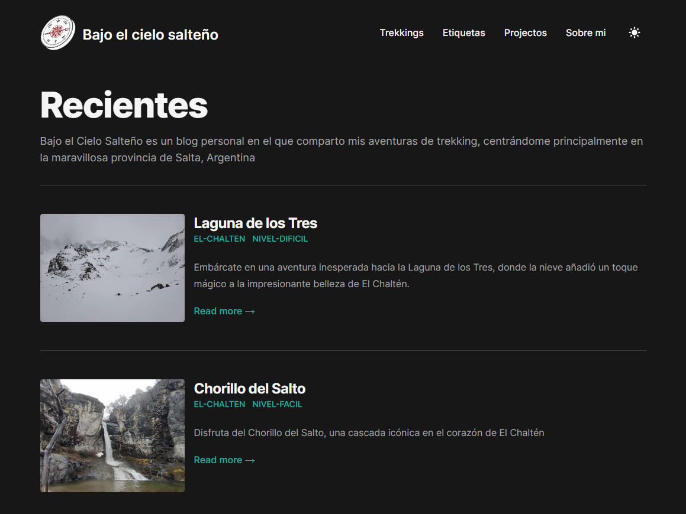

# My Trekking Blog 🏞️

Welcome to my personal trekking blog. Here, I share my adventures, routes, tips, and everything related to my passion for trekking and the mountains. The purpose of this space is to inspire and provide valuable information to all nature and outdoor enthusiasts.

## Technologies 🛠️

This blog was built using the [Tailwind Next.js Starter Blog](https://github.com/timlrx/tailwind-nextjs-starter-blog) template. I'd like to thank the creators and contributors of this template for making the creation of this space possible.

- **Framework**: Next.js
- **UI**: TailwindCSS
- **Hosting**: Vercel

## Features ✨

- **Responsive**: Looks great on both mobile and desktop devices.
- **Dark Mode**: For those who prefer a darker theme for their browsing experience.
- **MDX**: Write your posts in MDX, with support for custom components.

## Getting Started 🚀

If you're interested in using this template for your own blog, here are the steps to get started:

1. Clone the original [Tailwind Next.js Starter Blog](https://github.com/link-to-original-repository) repository.
2. Install the dependencies with `npm install` or `yarn install`.
3. Run the project locally with `npm run dev` or `yarn dev`.
4. Customize and create your content!

